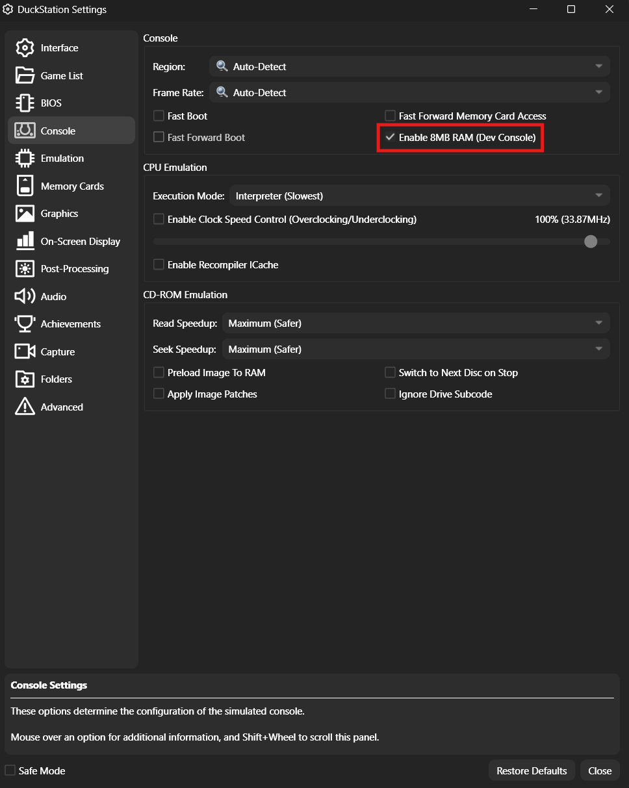

# Getting Started

The **Spyro 1 Practice ROM** is a mod for *Spyro the Dragon (NTSC)* that adds a suite of practice and speedrun tools, including full save states, a level select, IL timing, ghost replays, visualizers, and much more.

---

## Downloads

This mod supports multiple platforms. **Download the correct version for what you're going to play on** — the PS2 build will not work on PS1 or emulator, and vice versa.

| Platform | Save States | Ghost Replay | Notes |
|---|---|---|---|
|[PS2 75k–90k](https://github.com/C0mposer/Spyro-1-Practice-Rom/releases/download/fullrelease4.1/Spyro.1.Practice.Rom.PS2.Deckard.zip) | Full | Yes | Recommended console for full feature set |
| [PS2 30k–70k](https://github.com/C0mposer/Spyro-1-Practice-Rom/releases/download/fullrelease4.1/Spyro.1.Practice.Rom.PS2.IOP.zip) | Partial | No | Spyro/camera position only |
| [Duckstation](https://github.com/C0mposer/Spyro-1-Practice-Rom/releases/download/fullrelease4.1/Spyro.1.Practice.Rom.PS1.zip) | Full | Yes | Recommended emulator for full feature set |
| [PS1 & Other Emulators](https://github.com/C0mposer/Spyro-1-Practice-Rom/releases/download/fullrelease4.1/Spyro.1.Practice.Rom.PS1.zip) | Partial | No | Spyro/camera position only |

See [Platform Comparison](13-platform-comparison.md) for a complete breakdown.

---

## Patching Your Own ISO

If you already own a Spyro 1 `.bin` file and want to patch it yourself:

[Online Patcher](https://c0mposer.github.io/Spyro-1-Practice-Rom/)

---

## Emulator Setup Notes

- **Duckstation** is the recommended emulator.
- You **MUST** enable extra 8MB ram if you use the Duckstation version

---

## Contact & Help

Need help getting set up, or interested in Spyro / game modding in general?  
Reach out on Discord: **Composer** & **OddKara**
